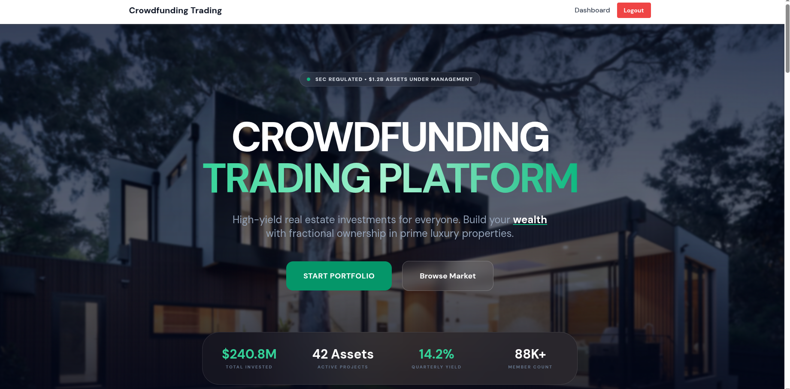

# 🚀 Crowdfunding Trading Platform | Frontend

High-performance, role-based crowdfunding ecosystem built with **React + Vite**. Scalable, secure, and developer-friendly.

---

## 🛠️ Tech Stack

- **Core:** React 18, Vite (Ultra-fast HMR)  
- **State:** Redux Toolkit (User, Auth, UI state)  
- **UI:** Tailwind CSS + Framer Motion (Smooth animations)  
- **Icons:** Lucide React  
- **API:** Axios + Response Interceptors (JWT Auth, Error handling)  
- **3D:** Three.js / Custom 3D Viewer integration  

---

## ✨ Key Features

- **Role-Based Access Control (RBAC):** Dedicated flows for Admins, Developers, and Investors  
- **Project Lifecycle:** Draft → Review → Approved → Funding mapping  
- **Investment Engine:** Real-time share calculation, portfolio tracking, and wallet management  
- **Security:** JWT-based persistent sessions & conditional restricted field access  
- **Interactive UI:** Dynamic marketplace filters, favorite system, and notification bridge  

---

## 🖼️ Dashboard Preview

Here’s the **Home UI screenshot** of the platform:



> *Note: The image path is relative to the `README.md` file in the root directory. GitHub supports spaces using `%20`.*  

---

## 🏗️ Architecture

- `/src/api`: Centralized service layer (`axiosInstance` + role-specific handlers)  
- `/src/components`: Atomic UI components & Layout wrappers  
- `/src/pages`: Role-segregated views (Admin / Dev / Investor)  
- `/src/router`: Guarded routes with role checking  

---

## 🚀 Quick Start

### 1️⃣ Install dependencies
```bash
npm install
