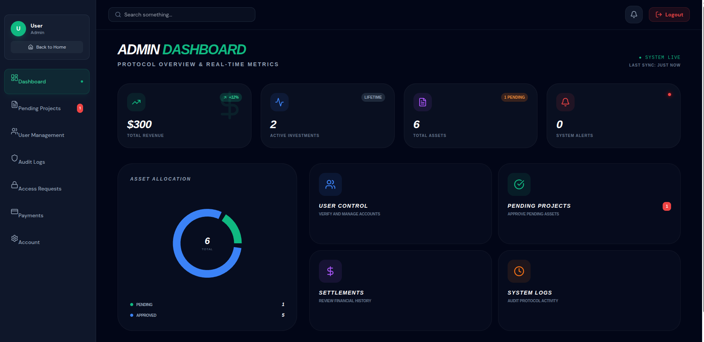
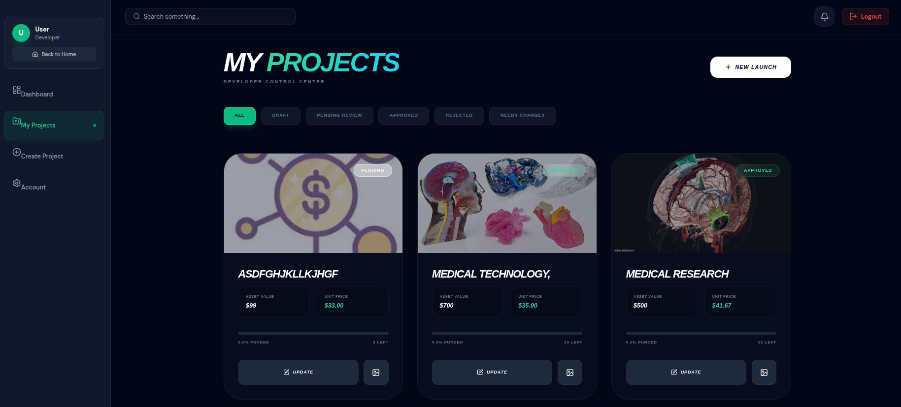
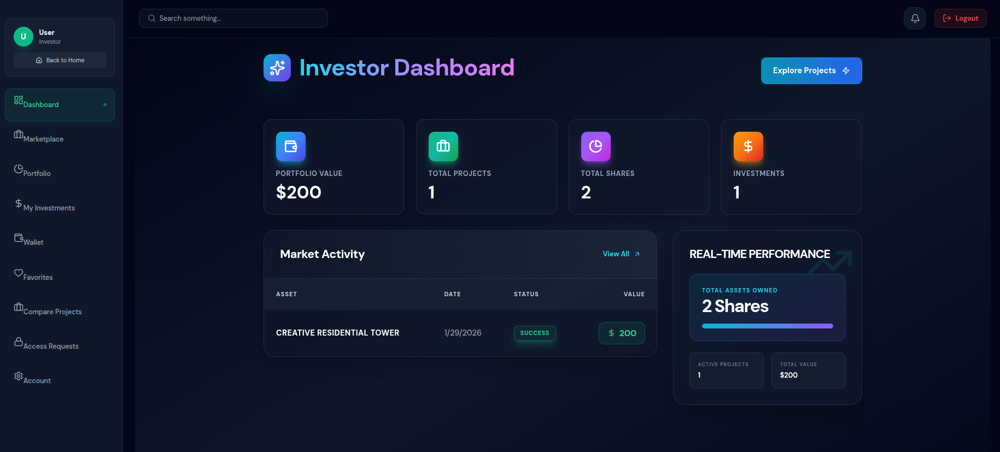

# 🚀 Crowdfunding & Trading Platform


A high-performance, real-time crowdfunding and capital trading ecosystem designed for **Investors**, **Developers**, and **Admins**. This platform facilitates seamless project submissions, access requests, and investment monitoring with a focus on visual excellence and real-time connectivity.

---

## 🏗️ Technical Architecture

### 🔔 Real-time Notification Engine
Integrated with a robust **Global WebSocket Context**, the platform provides instant feedback loops. Whether it's an Admin approving a project or an Investor requesting access, the system ensures zero-latency alerts with animated badge signals and toast notifications.

### 👥 Multi-Role Ecosystem
- **Admin Command Center:** Monitor project queues, audit logs, and manage user access requests.
- **Developer Portal:** Seamlessly submit projects for review, manage project media, and track funding status.
- **Investor Dashboard:** Browse vetted projects, request exclusive access, and manage personal investment portfolios.

### 💾 State & Data Management
utilizing **Redux Toolkit** for predictable global state and **React Context API** for environment-wide services (like WebSockets), ensuring data consistency across complex dashboard transitions.

---

## 🖼️ App Preview (Gallery)

| Home Page | Admin Dashboard |
| :---: | :---: |
|  |  |

| Developer Portal | Investor Interface |
| :---: | :---: |
|  |  |

---

## 🛠️ Quick Start

### Prerequisites
- Node.js (v18+)
- npm / yarn

### Installation
```bash
# Clone the repository
git clone https://github.com/tanzil-def/crowdfunding-frontend.git

# Install dependencies
npm install

# Setup environment variables
# Copy .env.example to .env and configure VITE_WS_URL and VITE_API_URL
```

### Development
```bash
npm run dev
```

---

## 🌐 Live Demo
[Explore the Platform](http://localhost:5173/)

## 👨‍💻 Author


**Tanzil**  
*Intern, BrainStation-23*  
[GitHub Profile](https://github.com/tanzil-def)

---
*Developed with ❤️ and focus on visual excellence.*
